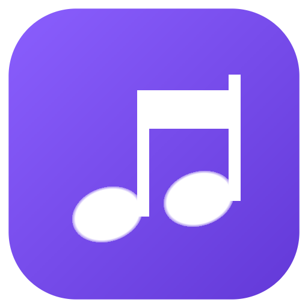
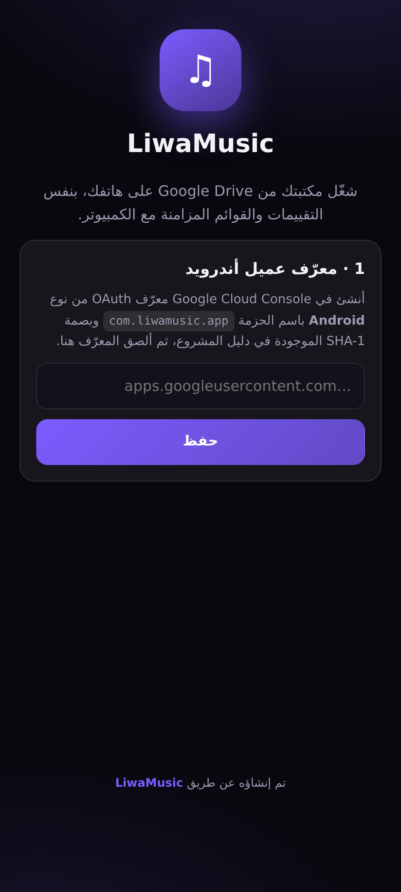
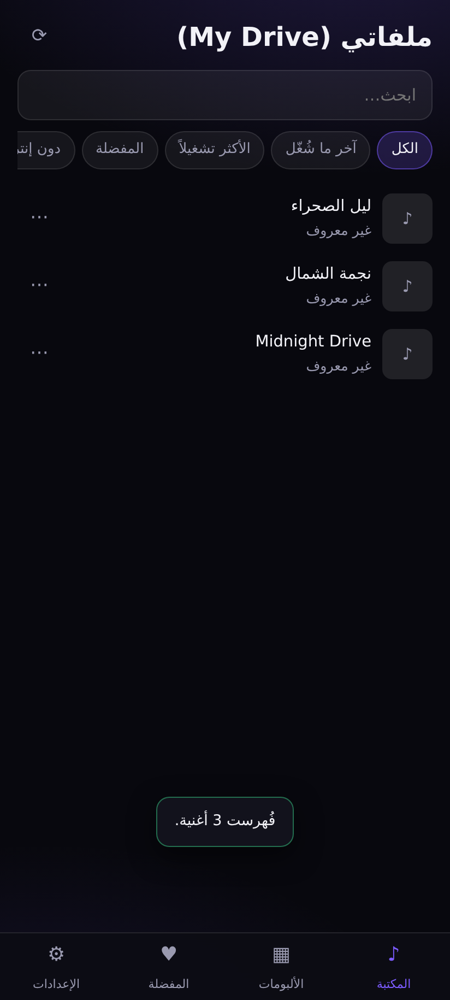
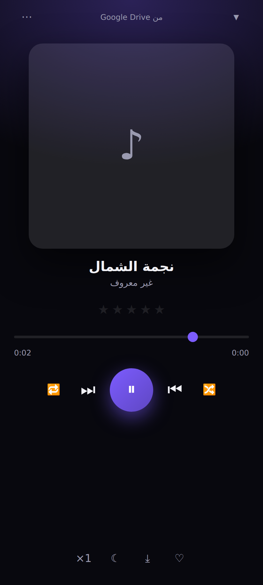
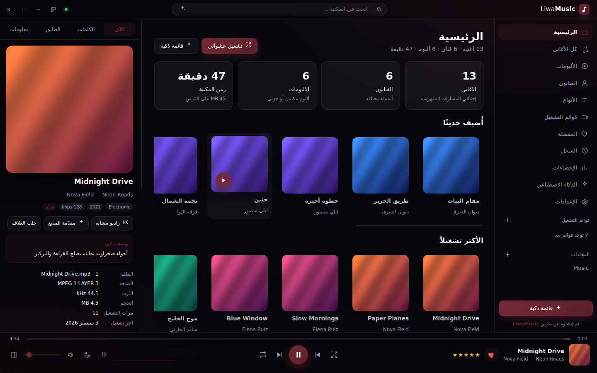
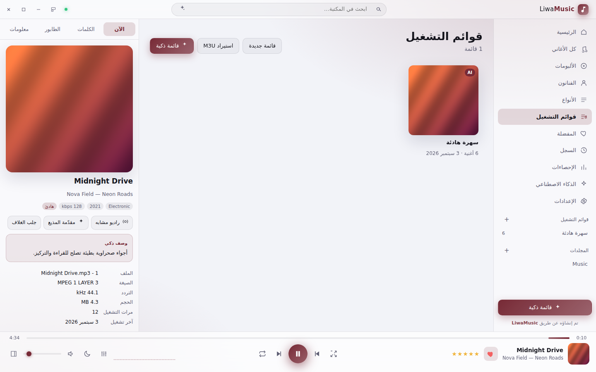

# LiwaMusic — مشغل وفهرس موسيقى ذكي لويندوز

<div align="center"><strong>تم إنشاؤه عن طريق LiwaMusic</strong></div>

<p align="center"></p>

تطبيق **سطح مكتب لويندوز** ترفع فيه مجلد أغانيك فيفهرسها ويشغّلها بمشغّل
حديث التصميم — من قرصك أو **من Google Drive مباشرة بلا تنزيل**. يستخدم
**الإنترنت** لإثراء المكتبة (أغلفة، كلمات متزامنة، بيانات الألبومات)، ويزامن
تقييماتك وقوائمك بين أجهزتك. وفيه ميزات **ذكاء اصطناعي** اختيارية عبر Claude
— **مغلقة افتراضيًا** لأنها وحدها تحتاج مفتاح API مدفوعًا.

---

## ⬇️ التحميل

[](https://github.com/almarar88/liwamusic/releases/latest)

### **[⬇ تحميل LiwaMusic 1.1.1 لويندوز (64-بت)](https://github.com/almarar88/liwamusic/releases/download/v1.1.1/LiwaMusic-Setup-1.1.1.exe)**

`LiwaMusic-Setup-1.1.1.exe` · ‎~90 ميجابايت · ويندوز 10/11 (x64)
· [آخر إصدار دائمًا](https://github.com/almarar88/liwamusic/releases/latest)

بعد التنزيل: شغّل `LiwaMusic-Setup-1.1.1.exe` واتبع خطوات التثبيت (يُثبَّت
للمستخدم الحالي بلا صلاحيات مدير)، ثم افتح **LiwaMusic** من قائمة ابدأ أو من
أيقونة سطح المكتب.

> ويندوز قد يُظهر تنبيه SmartScreen لأن ملف التثبيت غير موقّع رقميًا —
> اختر «مزيد من المعلومات» ثم «تشغيل على أي حال».

## 🚀 البدء في 30 ثانية

1. افتح التطبيق واضغط **إضافة مجلد أغاني** — أو اسحب المجلد وأفلته داخل النافذة.
2. تبدأ الفهرسة فورًا مع شريط تقدّم: قراءة الوسوم واستخراج الأغلفة.
3. اضغط أي أغنية مرتين لتشغيلها. البقية اختيارية ومتاحة متى شئت.

---

## ☁️ ربط Google Drive (اختياري)

شغّل أغانيك من درايف مباشرة **بلا تنزيلها**، وزامن تقييماتك وقوائمك بين
أجهزتك. الإعداد مرة واحدة، لأن الوصول إلى ملفاتك يتطلب موافقتك عبر حسابك أنت:

1. افتح [console.cloud.google.com](https://console.cloud.google.com/projectcreate) وأنشئ مشروعًا (أي اسم).
2. **APIs & Services ← Library** ← فعّل **Google Drive API**.
3. **OAuth consent screen** ← اختر **External** ← املأ الاسم والبريد ← أضف بريدك في **Test users**.
4. **Credentials ← Create credentials ← OAuth client ID** ← النوع **Desktop app**.
5. انسخ **Client ID** (و Client secret إن ظهر) وألصقهما في: LiwaMusic ← **Google Drive**.
6. اضغط **ربط الحساب** ← وافق في المتصفح ← ثم **تصفّح واختيار مجلد** الأغاني.

### أي نوع عميل تختار؟ (مهم)

جوجل تفرض قيودًا مختلفة على كل نوع، والخطأ هنا هو السبب الأول لفشل الربط:

| النوع | يصلح لـ | ملاحظات |
|---|---|---|
| **Desktop app** | نسخة الويندوز | **الأنسب**: يقبل أي منفذ محلي تلقائيًا، وبلا حاجة لتسجيل روابط. |
| **Android** | تطبيق الهاتف | **إلزامي للهاتف**: يحتاج اسم الحزمة `com.liwamusic.app` وبصمة SHA-1. |
| **Web application** | نسخة الويندوز فقط | يعمل بشرطين: أضف `http://127.0.0.1:8765` في **Authorized redirect URIs**، وألصق **Client secret** في التطبيق. **لا يصلح للهاتف إطلاقًا** لأن جوجل ترفض المخططات المخصّصة لهذا النوع (`Custom scheme URIs are not allowed for 'WEB' client type`). |

> نسخة الويندوز تستمع على المنفذ الثابت **8765** أولًا (فتعمل مع عملاء Web
> المسجَّلين)، وتسقط إلى منفذ عشوائي إن كان مشغولًا (عملاء Desktop يقبلون ذلك).

> شاشة «Google hasn't verified this app» طبيعية لأن التطبيق خاص بك:
> **Advanced ← Go to … (unsafe)**.

**الصلاحيات المطلوبة ضيّقة عمدًا:** `drive.readonly` (قراءة فقط — لا تعديل ولا
حذف) و`drive.appdata` (مجلد صغير خاص بالتطبيق للمزامنة، لا يظهر بين ملفاتك).
المفاتيح والرموز تُخزَّن مشفّرة على جهازك عبر `safeStorage` من ويندوز.

---

## 📱 تطبيق الأندرويد (APK)

نسخة هاتف تشغّل **نفس مكتبتك من درايف**، وتتزامن تلقائيًا مع نسخة الكمبيوتر
(التقييمات، المفضلة، قوائم التشغيل، تعديلات البيانات).

**[⬇ تحميل LiwaMusic.apk](https://github.com/almarar88/liwamusic/releases/download/android-v1.1.1/LiwaMusic.apk)**
· [كل إصدارات الأندرويد](https://github.com/almarar88/liwamusic/releases?q=android-v)

### الإعداد أول مرة

التطبيق يقبل نوعين من معرّفات OAuth — اختر ما يناسبك:

**(أ) نفس معرّف Desktop المستخدم على الكمبيوتر — بلا إعداد إضافي:**
ألصق **Client ID** و**Client secret** في التطبيق. يستخدم التطبيق تلقائيًا مخطط
جوجل المعكوس (`com.googleusercontent.apps.<معرّفك>`) وهو ما تقبله عملاء Desktop
على الجوال — فلا تحتاج بصمة SHA-1 ولا معرّفًا ثالثًا.

> المخطط يُسجَّل في مانيفست أندرويد عند البناء. لمعرّف مختلف عن الافتراضي، ابنِ
> الـ APK بمتغيّر `GOOGLE_REVERSED_SCHEME=com.googleusercontent.apps.<معرّفك>`.

**(ب) معرّف مخصّص من نوع Android — بلا Client secret:**

1. **Credentials ← Create credentials ← OAuth client ID** ← النوع **Android**.
2. **Package name**: `com.liwamusic.app`
3. **SHA-1 certificate fingerprint**:
   ```
   74:74:49:BA:ED:95:2F:A8:C6:65:AB:5D:3E:3A:27:D5:81:26:19:2C
   ```
4. ألصق **Client ID** فقط في التطبيق واترك حقل السرّ فارغًا.

> **عن بصمة SHA-1:** هذه بصمة مفتاح التوقيع المرفق في `mobile/signing/` — وُضع في
> المستودع كي تبقى البصمة ثابتة مع كل بناء (لو تغيّر المفتاح لتوقّف تسجيل الدخول).
> لأنه مفتاح عام، يستطيع أي أحد توقيع تطبيق بنفس الهوية — وهذا مقبول لتطبيق شخصي
> يُثبَّت جانبيًا. لمفتاح خاص بك: ولّد مفتاحًا، وضعه في أسرار المستودع باسم
> `ANDROID_KEYSTORE_B64` و`ANDROID_KEYSTORE_PASSWORD` و`ANDROID_KEY_ALIAS`
> (سير العمل يفضّلها تلقائيًا)، ثم حدّث البصمة في Google Cloud.

### ما يقدّمه تطبيق الهاتف
- تشغيل مكتبة درايف كاملة، مع **تحميل مسبق للأغنية التالية** فلا انتظار بينها.
- **حفظ للاستماع دون إنترنت** لأغنية واحدة أو للمكتبة كلها.
- قراءة **وسوم ID3 والغلاف المضمّن** بتنزيل 512 كيلوبايت فقط من كل ملف
  (يدعم ترميزات UTF-8 وUTF-16 وwindows-1256 للنصوص العربية).
- **تحكّم من شاشة القفل** وسماعات البلوتوث (Media Session).
- خلط، تكرار (الكل/أغنية)، سرعة تشغيل، مؤقت نوم، مفضلة، تقييم بالنجوم.
- بحث فوري واعٍ بالعربية، وتبويبات: المكتبة، الألبومات، المفضلة، الإعدادات.
- **مزامنة تلقائية** مع الكمبيوتر عند فتح التطبيق وعند الضغط على زر المزامنة.

> التثبيت: سيطلب أندرويد السماح بالتثبيت من مصدر غير معروف — طبيعي لأي تطبيق
> خارج متجر Play.

<p align="center">
  
  
  
</p>

---

## 📸 لقطات

| الرئيسية (مظهر داكن + تلوين مستخرج من الغلاف) | كل الأغاني |
|---|---|
|  |  |

| الكلمات المتزامنة | الإحصاءات |
|---|---|
|  |  |

<p align="center"><br/><sub>المظهر الفاتح — قوائم التشغيل</sub></p>

---

## ✨ المميزات (أكثر من 60)

### الفهرسة والمكتبة
1. **رفع مجلدات متعددة** عبر نافذة الاختيار أو السحب والإفلات داخل التطبيق.
2. **مسح متكرر** لكل المجلدات الفرعية مع تجاهل المخفية وغير الصوتية.
3. **17 صيغة مدعومة**: MP3، FLAC، M4A/AAC، WAV، OGG، OPUS، AIFF، WMA، APE، WavPack…
4. **قراءة الوسوم الكاملة**: العنوان، الفنان، فنان الألبوم، الألبوم، النوع، السنة، رقم المقطع والقرص، معدل البت، التردد، القنوات، الترميز، وهل التسجيل بلا فقد.
5. **استخراج الأغلفة المضمّنة** وحفظها في كاش مشترك لكل ألبوم (لا تكرار).
6. **مسح تزايدي ذكي**: يتخطى الملفات غير المتغيّرة (بحسب الحجم ووقت التعديل)، ويلتقط الجديد ويحذف المفقود.
7. **مراقبة المجلدات** تلقائيًا: أي أغنية جديدة تُضاف على القرص تدخل الفهرس بلا تدخّل.
8. **كشف الأغاني المكررة** (نفس العنوان والفنان والمدة) مع عرض المسارات.
9. **تصدير/استيراد المكتبة** كاملة (الفهرس + التقييمات + القوائم) بملف JSON واحد.
10. **تحرير البيانات محليًا** داخل التطبيق دون المساس بملفاتك الأصلية إطلاقًا.

### التشغيل والصوت
11. **محرّك Web Audio كامل** بسلسلة معالجة احترافية بدل مشغّل بسيط.
12. **طابور تشغيل** قابل لإعادة الترتيب بالسحب، مع «تشغيل التالي» وإزالة وتفريغ.
13. **خلط وتكرار** (إيقاف / تكرار الكل / تكرار الأغنية).
14. **تلاشٍ متقاطع** بين الأغاني حتى 12 ثانية (ديكان صوتيان مستقلان).
15. **تحميل مسبق للأغنية التالية** لانتقال شبه متواصل بلا صمت.
16. **معادل صوتي بعشرة نطاقات** (32Hz–16kHz) مع **11 قالبًا** جاهزًا: مسطّح، بوب، روك، جاز، كلاسيكي، تعزيز الجهير، تعزيز الحدّة، الصوت البشري، إلكتروني، شرقي، وضع ليلي.
17. **تضخيم مسبق (Preamp)** من ‎-12‎ إلى ‎+12‎ ديسيبل.
18. **تطبيع الصوت** لتقليل فروق الجهارة بين الأغاني (ضاغط ديناميكي).
19. **سرعة تشغيل** من 0.5× إلى 2× مع **الحفاظ على طبقة الصوت**.
20. **مؤثر بصري حي** (أعمدة طيفية أو موجة) بلون الواجهة.
21. **مؤقت النوم** مع تلاشٍ تدريجي قبل التوقف.
22. **استئناف آخر جلسة**: يفتح على آخر أغنية وموضعها بالضبط.
23. **مفاتيح الوسائط في لوحة المفاتيح** تعمل حتى والتطبيق في الخلفية.
24. **تكامل مع نظام ويندوز** عبر Media Session (اسم الأغنية والغلاف في لوحة الوسائط) و**شريط تقدّم على أيقونة شريط المهام**.

### الإنترنت
25. **جلب الأغلفة الناقصة** من iTunes بدقة 600×600 وتطبيقها على كل الألبوم.
26. **كلمات الأغاني المتزامنة** من LRCLIB مع تمييز السطر الحالي، تمرير تلقائي، والنقر على أي سطر للانتقال إليه.
27. **إثراء البيانات من MusicBrainz** (السنة، النوع، الوسوم) مع إمكانية تطبيقها بضغطة.
28. **نبذة عن الفنان** من ويكيبيديا (عربي ثم إنجليزي).
29. **مؤشر حالة الاتصال** — كل شيء يعمل بلا إنترنت، والميزات الشبكية إضافة لا شرط.

### الذكاء الاصطناعي — **مغلق افتراضيًا** (اختياري، بمفتاحك)

> هذا القسم كله **مطفأ عند أول تشغيل**: لا تظهر صفحته ولا أزراره في الواجهة،
> ولا يُرسل أي طلب ولا يُحسب عليك أي مبلغ. لتفعيله لاحقًا:
> **الإعدادات ← الميزات الذكية ← تفعيل**، ثم أدخل مفتاح Anthropic API.
> بقية التطبيق — الفهرسة والتشغيل والأغلفة والكلمات — يعمل كاملًا ومجانًا.
30. **تصنيف ذكي** لكل أغنية: المزاج، مستوى الطاقة، الأنواع، وكلمات مفتاحية.
31. **قائمة تشغيل من وصف بلغتك**: «قائمة هادئة للمذاكرة الليلية» — ويختار من مكتبتك فقط بلا اختراع أغانٍ.
32. **بحث دلالي** يفهم القصد لا الكلمات الحرفية.
33. **راديو مشابه**: يبني قائمة تشبه أي أغنية في الأجواء والطاقة مع تنويع الفنانين.
34. **مقدّمات مذيع** متدفقة كلمة بكلمة بين الأغاني.
35. **تقرير رؤى** عن ذوقك، الأنواع الغالبة، والفجوات في مكتبتك.
36. **مفتاح API مشفّر** عبر `safeStorage` من ويندوز، ولا يغادر جهازك ولا تصل إليه الواجهة.

### الواجهة والتجربة
37. **إحدى عشرة صفحة** (عشر عند إغلاق الميزات الذكية): الرئيسية، كل الأغاني، الألبومات، الفنانون، الأنواع، قوائم التشغيل، المفضلة، السجل، الإحصاءات، الذكاء الاصطناعي، والإعدادات.
38. **قائمة افتراضية (Virtual list)** ترسم الصفوف المرئية فقط — عشرات الآلاف من الأغاني بسلاسة.
39. **بحث فوري واعٍ بالعربية**: يوحّد الهمزات والألف والتاء المربوطة ويتجاهل التشكيل.
40. **مفضلة وتقييم بالنجوم** وعدّاد تشغيل وآخر استماع وسجل كامل.
41. **قوائم تشغيل** كاملة مع **استيراد وتصدير M3U8**.
42. **مظهر داكن/فاتح**، ستة ألوان أساسية، و**تلوين ديناميكي مستخرج من غلاف الأغنية الحالية**.
43. **عربي/إنجليزي** مع تبديل الاتجاه RTL/LTR فوريًا.
44. **مشغّل مصغّر** يبقى فوق النوافذ، **اختصارات لوحة مفاتيح كاملة**، وقوائم سياق بالزر الأيمن على كل عنصر.

### الجديد في 1.1 — Google Drive والأغلفة والإجراءات الجماعية
45. **تشغيل مباشر من درايف** بالبثّ، مع تنقّل داخل الأغنية (Range) بلا تنزيلها كاملة.
46. **متصفّح مجلدات درايف** داخل التطبيق لاختيار أي مجلد (أو «ملفاتي» كله).
47. **فهرسة ملفات درايف** تلقائيًا مع كشف الجديد والمحذوف بمقارنة بصمة الملف.
48. **قراءة الوسوم بلا تنزيل**: يُنزّل 512 كيلوبايت فقط من كل ملف لاستخراج العنوان والفنان والغلاف.
49. **حفظ أغانٍ مختارة للاستماع دون إنترنت** مع مدير تخزين مؤقت (حجم، تفريغ، إزالة مفردة).
50. **مزامنة بين أجهزتك** عبر ملف مخفي في مجلد التطبيق بدرايف: التقييمات، المفضلة، القوائم، التعديلات، والأغلفة المخصّصة.
51. **دمج ذكي بالطوابع الزمنية** لكل عنصر — لا تضيع تعديلات جهاز إذا زامن الآخر بعده، مع شواهد حذف تمنع عودة المحذوف.
52. **تغيير غلاف أغنية واحدة** من أي صورة على جهازك.
53. **تغيير غلاف ألبوم كامل** دفعة واحدة.
54. **تغيير غلاف التحديد** مهما بلغ عدده.
55. **غلاف من رابط إنترنت** مباشرة.
56. **إزالة الغلاف المخصّص** والعودة للأصلي المضمّن.
57. **جلب الأغلفة الناقصة جماعيًا** لكل ما تراه، مع شريط تقدّم حي.
58. **معالجة الصور تلقائيًا**: تصغير إلى 640 بكسل وتوحيد إلى JPEG، وعدم تكرار الصورة نفسها على القرص.
59. **تحديد متعدد** بالنقر وCtrl وShift وCtrl+A، مع شريط إجراءات جماعية عائم.
60. **تعديل جماعي للوسوم** (فنان/ألبوم/نوع/سنة) لأي عدد من الأغاني دفعة واحدة.
61. **شارة مصدر** تميّز أغاني درايف عن المحلية داخل القوائم.

---

## ⌨️ الاختصارات

| المفتاح | الوظيفة | المفتاح | الوظيفة |
|---|---|---|---|
| مسافة | تشغيل/إيقاف | `S` | الخلط |
| `Ctrl + →` | التالي | `R` | التكرار |
| `Ctrl + ←` | السابق | `M` | كتم الصوت |
| `→` / `←` | ‎±5‎ ثوانٍ | `F` | مفضلة |
| `↑` / `↓` | الصوت | `E` | المعادل |
| `Ctrl + F` | البحث | `L` | الكلمات |
| `Ctrl + M` | المشغّل المصغّر | `Q` | الطابور |
| `1`…`5` | التقييم بالنجوم | | |

---

## 🔐 الخصوصية

- لا يوجد خادم لـ LiwaMusic ولا حساب ولا تتبّع. كل البيانات في مجلد بيانات
  التطبيق على جهازك.
- طلبات الإنترنت تذهب **مباشرة** من جهازك إلى: iTunes (الأغلفة)، LRCLIB
  (الكلمات)، MusicBrainz (البيانات)، ويكيبيديا (نبذة الفنان)، وAnthropic
  (الذكاء الاصطناعي — **مغلق افتراضيًا**، فلا طلب ولا تكلفة ما لم تفعّله بنفسك).
  ويمكن إطفاء كل واحدة منها من الإعدادات.
- الذكاء الاصطناعي يرسل **بيانات وصفية فقط** (عنوان/فنان/ألبوم/نوع/سنة) — لا
  يُرفع أي ملف صوتي أبدًا.
- **Google Drive**: الصلاحيات قراءة فقط (`drive.readonly`) + مجلد التطبيق
  (`drive.appdata`). لا يستطيع التطبيق تعديل أو حذف أي ملف في درايف، ورموز
  الدخول تُخزَّن مشفّرة على جهازك.
- الواجهة معزولة (`contextIsolation`) بلا وصول إلى Node، والملفات تُقدَّم عبر
  بروتوكول `liwa://` مقصور على الملفات المفهرسة فعلًا.

## 🛠️ التطوير والبناء

```bash
git clone https://github.com/almarar88/liwamusic
cd liwamusic
npm install
npm start        # تشغيل التطبيق
npm test         # اختبار ذاتي (110 فحصًا) للفهرسة والتخزين والبروتوكول و M3U
npm run dist:win # بناء مثبّت ويندوز (يحتاج ويندوز)
```

البناء الآلي عبر GitHub Actions: ادفع وسمًا يبدأ بـ `v` (مثل `v1.1.0`)
أو شغّل سير العمل **«بناء LiwaMusic لويندوز»** يدويًا من تبويب Actions.

### البنية

```
.
├── electron/
│   ├── main.js              العملية الرئيسية: النافذة، IPC، بروتوكول liwa://
│   ├── preload.js           جسر آمن معزول للواجهة
│   └── lib/
│       ├── scanner.js       الفهرسة وقراءة الوسوم واستخراج الأغلفة
│       ├── store.js         تخزين JSON بكتابة مؤجّلة وآمنة
│       ├── online.js        iTunes / LRCLIB / MusicBrainz / ويكيبيديا
│       ├── ai.js            تكامل Claude (مفتاح المستخدم، مشفّر)
│       ├── playlists.js     القوائم و M3U8
│       ├── drive.js         Google Drive: OAuth و PKCE، تصفّح، بثّ، كاش
│       ├── sync.js          دمج بيانات المستخدم بين الأجهزة بالطوابع الزمنية
│       ├── artwork.js       الأغلفة المخصّصة (مفردة وجماعية) ومعالجة الصور
│       └── filestream.js    خدمة الملفات مع دعم Range للتنقّل
├── renderer/
│   ├── index.html · css/app.css
│   └── js/  util · i18n · player (محرّك Web Audio) · views · panels · app
└── mobile/                  تطبيق الأندرويد (Capacitor)
    ├── www/js/  drive · store (IndexedDB + مزامنة) · tags (قارئ ID3) · app
    ├── signing/             مفتاح توقيع ثابت (بصمة SHA-1 في قسم الأندرويد)
    └── scripts/             تهيئة مشروع أندرويد وتوليد الأيقونات
```

---

<div align="center">تم إنشاؤه عن طريق <strong>LiwaMusic</strong></div>
